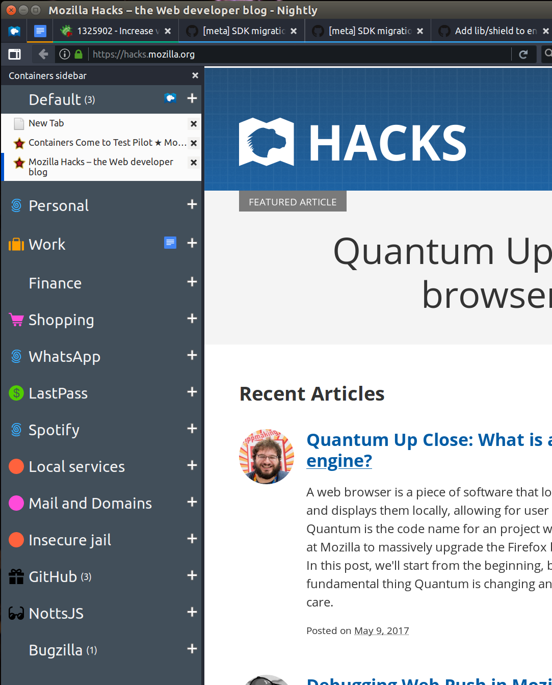

# [Sea Containers](https://addons.mozilla.org/en-GB/firefox/addon/sea-containers/?src=search)

## What it does

Opens a sidebar to manage containers



To open the sidebar use Ctrl/Cmd+Shift+Period.

# Installing

- Requires Firefox 54 or later
  - [Download Firefox](https://www.mozilla.org/firefox/browsers/)
  - [Download Nightly Firefox](https://www.mozilla.org/firefox/nightly/all/)
- Requires [containers enabled](https://testpilot.firefox.com/experiments/containers)
- [Download from Firefox Add-ons](https://addons.mozilla.org/firefox/addon/sea-containers/)

# Installing to debug

- Requires Firefox 54 or later
  - [Download Beta](https://www.mozilla.org/firefox/browsers/)
  - [Download Nightly Firefox](https://www.mozilla.org/firefox/nightly/all/)
- Requires [containers enabled](https://testpilot.firefox.com/experiments/containers)
- Go to about:debugging
- Load Temporary Addon
- Click the manifest file in this directory
- As this is a debugging extension, it wont last after a restart.
  - This is currently going through review process to be installable through addons.mozilla.org

# Demo as sidebar only

Firefox lets users override 'chrome' level styles. Add a chrome directory and create a `chrome/userChrome.css` file with the following contents:

```
@namespace url("http://www.mozilla.org/keymaster/gatekeeper/there.is.only.xul");
#TabsToolbar {
  visibility: collapse;
}
```

When firefox is reloaded you won't have any horizontal tabs.


# Credits

- https://thenounproject.com/search/?q=container&i=715166
